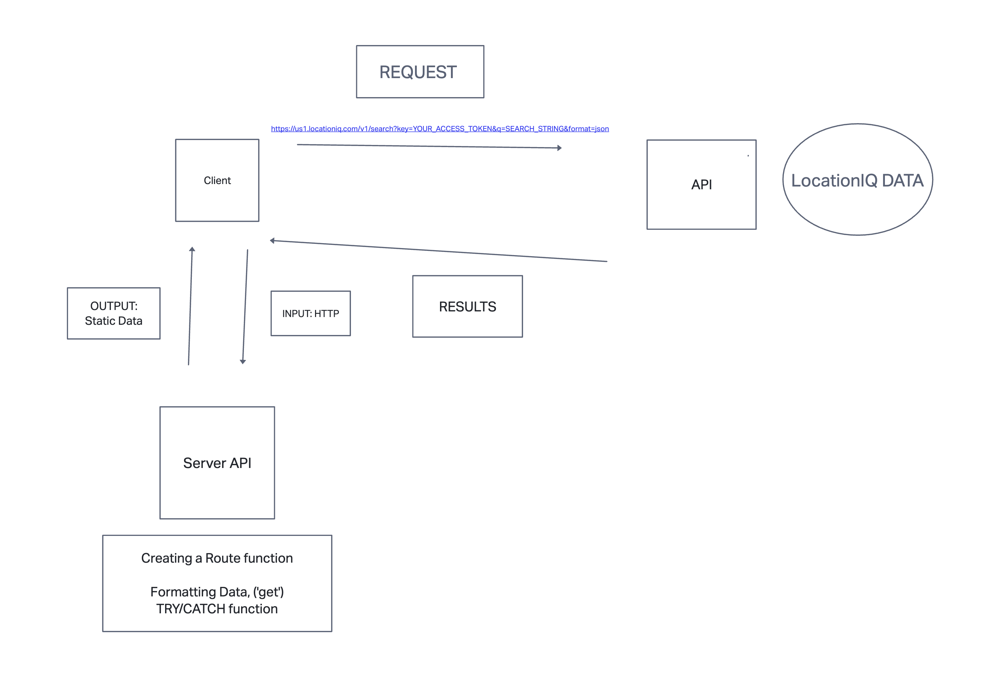
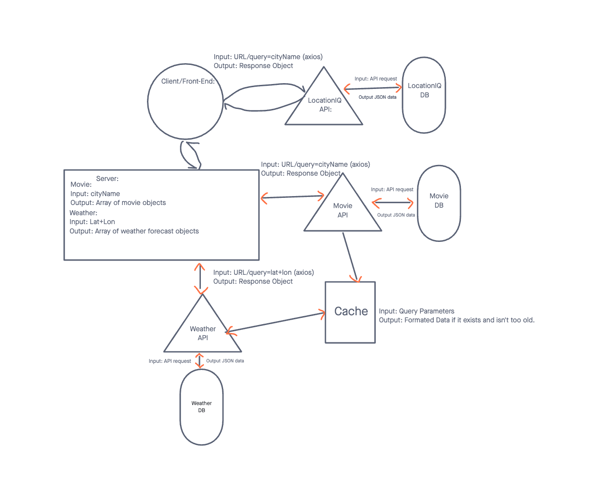

# City Explorer API

**Author**: Zeegii Ulziibaatar
**Version**: 1.0.0 (increment the patch/fix version number if you make more commits past your first submission)

## Overview

Backend server of the city explorer application that offers user the exact longitude and lattitude of the location they're looking for.

## Getting Started

  1. I will create repo in Github and local machine.
  2. Create the environment, install the libraries.
  3. Create env file, and ignore it before I push it to the github.
  4. Code, and ACP.

## Architecture

I will use NodeJS to build this server. 

## Change Log

05-06-2023 2:00 pm - Created the environment. Initialized the git.
<!-- 01-01-2001 4:59pm - Application now has a fully-functional express server, with a GET route for the location resource. -->

## Credit and Collaborations

Jonathan Brooks - lab07, whiteboarding partner.
Jacob Basset = lab 09, lab10 - whiteboarding partner. 

## Time Estimates

<!-- For each of the lab features, make an estimate of the time it will take you to complete the feature, and record your start and finish times for that feature: -->

Name of feature: Starting the app.

Estimate of time needed to complete: 05/06/2023 6:00pm

Start time: 05/06/2023 1:00pm

Finish time: 05/04/2023 07:00pm

Actual time needed to complete: 6 hours;

### Web Response

;

;
